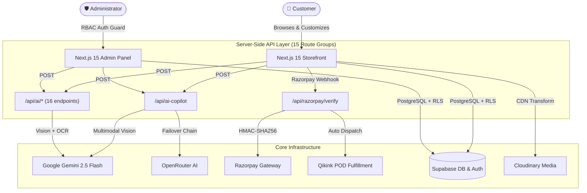

<div align="center">

# 🎨 Alpona Studio

### Premium Print-on-Demand E-Commerce & AI Platform

**Official Submission — Adamas University Hackathon: GameLiminals × VibeForge 1.0**
*Track: AI in Finance & E-Commerce*

[](https://nextjs.org/)
[](https://www.typescriptlang.org/)
[](https://tailwindcss.com/)
[](https://supabase.com/)
[](https://ai.google.dev/)
[](https://razorpay.com/)
[](LICENSE)

[Features](#-key-highlights) · [AI Suite](#-alpona-ai-copilot-suite) · [Pages Directory](#-complete-application-page-directory-63-pages) · [Architecture](#-system-architecture) · [Quickstart](#-quickstart--local-development)

---

</div>

## 🌟 Executive Summary

**Alpona Studio** is a full-stack, production-grade **Print-on-Demand (POD)** e-commerce platform built for creative expression, automated print logistics, and AI-powered financial intelligence. It combines custom streetwear design, sub-second checkout, automated Qikink POD fulfillment, and multi-modal AI into a unified digital flagship.

At its core sits the **Alpona AI Copilot** — a server-side intelligence suite powered by **Google Gemini 2.5 Flash** with multimodal vision, automatic failover to OpenRouter, and 16+ dedicated AI API endpoints covering everything from shopping assistance to fraud detection, dynamic pricing, inventory forecasting, and product image OCR.

> [!TIP]
> **Production Ready**: Optimized with 5-minute ISR, hardware-accelerated 60 FPS hero animations, dynamic Cloudinary CDN image compression, Razorpay HMAC-SHA256 payment verification, and zero TypeScript compilation errors.

---

## ⚡ Key Highlights

| Module | Capabilities |
| :--- | :--- |
| **🤖 AI Intelligence (16+ Endpoints)** | Gemini 2.5 Flash Multimodal Vision — Shopping Copilot, Smart Recommendations, Fraud Risk Scoring, Dynamic Pricing, Product OCR, Inventory Forecasting, Review Summarization, Size Recommendation, Visual Search, Auto-Tagging, Customer Segmentation, Return Risk Analysis |
| **🎨 Design Studio** | Interactive custom apparel editor with print positioning (Front / Back / Pocket), DTF & Embroidery finish selection, text layers, logo upload, and instant mockup preview |
| **🛍️ Dynamic Catalog** | Multi-facet filtering (category, subcategory, size, color, price range, gender), grid/list toggle, dual Men + Women taxonomy, and 5-minute ISR |
| **💳 Payments & POD** | Razorpay gateway (UPI/Card/NetBanking) with HMAC-SHA256 verification, COD with pincode coverage check, and automated Qikink POD dispatch |
| **🛡️ Admin Suite (15 Modules)** | Real-time sales KPIs, order pipelines with AI fraud badges, product CRUD, customer CRM, review moderation, coupon management, analytics dashboards, and CSV export |
| **🖼️ Media Pipeline** | Cloudinary CDN with auto WebP/AVIF, clipboard paste-to-upload (Ctrl+V), drag-and-drop, and SVG vector brand emblem system |
| **📱 Progressive Web App** | Service worker, web manifest, responsive mobile-first design, and offline-capable asset caching |

---

## 🤖 Alpona AI Copilot Suite

All AI features execute securely via server-side API routes using **Google Gemini 2.5 Flash** with multi-provider failover chain (`gemini-2.5-flash` → `hcnsec.cn` (`auto`) → `openrouter`). API keys are **never** exposed to the client.

```
                  ┌──────────────────────────────────────────────┐
                  │     Alpona AI Engine (Server-Side Only)      │
                  │   Google Gemini 2.5 + HCNSEC + OpenRouter    │
                  └───────────────────────┬──────────────────────┘
                                          │
    ┌─────────────┬──────────────┬────────┴────────┬──────────────┬─────────────┐
    ▼             ▼              ▼                 ▼              ▼             ▼
┌─────────┐ ┌──────────┐ ┌────────────┐ ┌───────────────┐ ┌──────────┐ ┌────────────┐
│Shopping │ │  Smart   │ │   Fraud    │ │   Dynamic    │ │ Product  │ │ Inventory  │
│Copilot  │ │  Recs    │ │  Scoring   │ │   Pricing    │ │ OCR &    │ │ Forecast & │
│(Chat)   │ │(PDP/Home)│ │(Admin)     │ │(Admin)       │ │Describe  │ │ 12 More    │
└─────────┘ └──────────┘ └────────────┘ └───────────────┘ └──────────┘ └────────────┘
```

### 🛒 Customer-Facing AI

| Feature | Description |
| :--- | :--- |
| **Shopping Copilot** | Floating chat widget on every page — natural language concierge delivering style advice, sizing guidance, and interactive product cards inside conversations |
| **Smart Recommendations** | Contextual product pairings on Homepage and PDP with personalized rationale badges and category-similarity fallback |
| **Size Recommendation** | AI-driven body-fit matching based on garment measurements and user preferences |
| **Visual Search** | Image-based product discovery powered by Gemini vision capabilities |
| **Smart Search** | Natural language product search with intent understanding |

### 🛡️ Admin-Facing AI

| Feature | Description |
| :--- | :--- |
| **Fraud Risk Scoring** | Multi-factor risk badges (Low/Medium/High, 0–100 score) evaluating order value anomalies, account age, rapid velocity, and high-ticket first purchases |
| **Dynamic Pricing** | AI-powered pricing suggestions with Gemini 2.5 Flash vision analysis of product images for OCR text detection (e.g., Bengali typography recognition) |
| **Product Auto-Describe** | Multimodal vision OCR — reads garment text, fabric details, and design elements from product photos to generate accurate titles and descriptions |
| **Inventory Forecasting** | Demand prediction and re-order alerts based on sales velocity analysis |
| **Customer Segmentation** | AI-powered customer cohort analysis for targeted marketing |
| **Return Risk Analysis** | Predictive return probability scoring per order |
| **Review Summarization** | Automated sentiment aggregation across customer reviews |
| **Business Insights** | Executive strategic intelligence synthesizing revenue trends, order velocity, top categories, and cancellation rates |
| **Auto-Tagging** | Automatic product tag generation from images and descriptions |

---

## 🗺️ Complete Application Page Directory (63 Pages)

Alpona features **63 dedicated pages, tabs, and module views** across storefront, account, authentication, admin, and seller hub.

<details open>
<summary><b>🛍️ 1. Storefront & Customer Pages (25 Pages)</b></summary>

| # | Page | Route | Highlights |
|---|------|-------|------------|
| 1 | **Homepage** | `/` | 60fps frame-sequence hero animation, category hubs, trending carousel, AI recommendations, scroll story, testimonials, FAQ, newsletter |
| 2 | **Shop Catalog** | `/shop` | Multi-facet filtering, grid/list toggle, price slider, sort controls, dual Men+Women gender taxonomy, 5-min ISR |
| 3 | **Product Detail** | `/shop/[slug]` | Hi-res gallery with lightbox, variant pickers (size/color), fabric accordions, AI size recommender, reviews, sticky mobile purchase bar |
| 4 | **Design Studio** | `/design-studio` & `/create` | Interactive 2D/3D apparel builder, print position toggle, DTF/Embroidery finish, text editor, logo upload, instant mockups |
| 5 | **Style Match AI** | `/style-match` | AI aesthetic quiz for personalized apparel recommendations |
| 6 | **Design DNA** | `/design-dna` | Visual streetwear culture feed and print finish stories |
| 7 | **Shopping Cart** | `/cart` | Quantity management, promo coupon drawer, gift wrapping (+₹59), priority delivery (+₹100) |
| 8 | **Checkout** | `/checkout` | Single-page checkout, address manager, pincode delivery check, Razorpay UPI/Card gateway, COD, HMAC verification, independent gift wrap & box packing toggles |
| 9 | **Order Tracking** | `/order/track` & `/track-order` | Public lookup with Order ID + phone for real-time shipment status |
| 10 | **Order Success** | `/order/success` | Confirmation with order breakdown, payment badge, delivery timeline, downloadable receipt |
| 11 | **Wishlist** | `/wishlist` | Saved product gallery with quick add-to-cart and persistent sync |
| 12 | **Reviews** | `/reviews` | Community reviews wall with aggregate ratings, photo gallery, verified purchase badges |
| 13 | **FAQ & Help** | `/faq` & `/help` | Searchable knowledge base with accordion topics and AI help |
| 14 | **Contact** | `/contact` | Contact form, support details, business hours, response time badge |
| 15 | **About** | `/about` | Brand story, zero-waste POD mission, fabric quality standards |
| 16 | **Affiliate** | `/affiliate` | Creator partner onboarding with commission tiers and earning calculator |
| 17 | **Referral** | `/referral` | "Give ₹200, Get ₹200" hub with shareable links and WhatsApp share |
| 18 | **Gift Cards** | `/gift-cards` | Digital voucher store (₹500–₹5,000) with recipient email and live preview |
| 19 | **Size Guide** | `/size-guide` | Measurement charts for Regular, Oversized, Boxy, and Hoodie fits |
| 20 | **Shipping Policy** | `/shipping` | Rates, pincode map, free shipping threshold (₹999+), carrier SLAs |
| 21 | **Returns Policy** | `/returns` | 7-day hassle-free return guidelines and automated return workflow |
| 22 | **Privacy Policy** | `/privacy` | Data protection, cookie policy, encryption protocols |
| 23 | **Terms & Conditions** | `/terms` | IP rules, print copyright, payment terms, user conduct |
| 24 | **Blog Catalog** | `/blog` | Fashion journal, design tips, printing guides, style lookbooks |
| 25 | **Blog Article** | `/blog/[slug]` | Rich article viewer with read time, author bio, social sharing |

</details>

<details open>
<summary><b>👤 2. User Account Dashboard (16 Pages)</b></summary>

| # | Page | Route |
|---|------|-------|
| 26 | Account Overview | `/account` |
| 27 | My Orders | `/account/orders` |
| 28 | Profile Settings | `/account/profile` |
| 29 | Saved Addresses | `/account/addresses` |
| 30 | Coupons & Offers | `/account/coupons` |
| 31 | Account Wishlist | `/account/wishlist` |
| 32 | My Reviews | `/account/reviews` |
| 33 | Connected Devices | `/account/devices` |
| 34 | Language & Regional | `/account/language` |
| 35 | Security & Password | `/account/password` |
| 36 | Account Settings | `/account/settings` |
| 37 | Support Tickets | `/account/faq` |
| 38 | Community Q&A | `/account/qa` |
| 39–40 | Legal & Privacy | `/account/legal` & `/account/privacy` |
| 41 | Seller Hub Onboarding | `/account/seller-hub` |

</details>

<details>
<summary><b>🔐 3. Authentication Pages (3 Pages)</b></summary>

| # | Page | Route |
|---|------|-------|
| 42 | Sign In | `/auth/login` — Email/Password, Google OAuth 2.0, Remember Me |
| 43 | Create Account | `/auth/signup` — Password strength meter, email verification |
| 44 | Forgot Password | `/auth/forgot-password` — Secure single-use reset tokens |

</details>

<details open>
<summary><b>🛠️ 4. Admin Dashboard (19 Modules)</b></summary>

| # | Module | Route | Highlights |
|---|--------|-------|------------|
| 45 | Dashboard Overview | `/admin` | Revenue KPIs, order velocity, gateway status, sales chart, AI strategic insights |
| 46 | Products Catalog | `/admin/products` | Search, status toggles, price quick-edit, category filter, pagination |
| 47 | Create Product | `/admin/products/create` | Multi-step builder, Cloudinary upload, clipboard paste (Ctrl+V), dual Men+Women audience, AI auto-describe with vision OCR |
| 48 | Edit Product | `/admin/products/[id]` | Full product management with variant pricing and gallery |
| 49 | Import Products | `/admin/products/import` | CSV import & Qikink POD catalog sync |
| 50 | Categories | `/admin/categories` | Category taxonomy manager |
| 51 | Subcategories | `/admin/subcategories` | Subcategory-to-parent mapping |
| 52 | Product Types | `/admin/product-types` | Garment style classification (240GSM, Boxy Fit, French Terry) |
| 53 | Orders | `/admin/orders` | Fulfillment center with AI fraud risk scores, status pipelines, Qikink dispatch, CSV export |
| 54 | Customers | `/admin/customers` | CRM table with LTV, order count, registration dates |
| 55 | Design Assets | `/admin/designs` | Custom design vault with copyright licensing |
| 56 | Coupons | `/admin/coupons` | Promotional campaign creator with usage limits and expiry |
| 57 | Analytics | `/admin/analytics` | Revenue graphs, conversion metrics, regional distribution |
| 58 | AI Insights | `/admin/ai-insights` | Demand forecasting, inventory alerts, dynamic pricing suggestions |
| 59 | Reviews Moderation | `/admin/reviews` | Approve, feature, or hide customer reviews |
| 60 | Store Settings | `/admin/settings` | Store profile, GST, currency, brand logo |
| 61 | Shipping Rules | `/admin/shipping` | Flat rates, free shipping minimums, carrier API config |
| 62 | Support Helpdesk | `/admin/support` | Customer query ticketing desk |
| 63 | Staff & Roles | `/admin/users` | RBAC panel for admin/moderator/support permissions |

</details>

<details>
<summary><b>🎨 5. Seller Hub (1 Page)</b></summary>

| # | Page | Route |
|---|------|-------|
| 64 | Seller Creator Hub | `/seller` & `/seller/products` — Design sales tracking, royalties, artwork submission, payout requests |

</details>

---

## 📐 System Architecture



---

## 🛠️ Technology Stack

| Layer | Technology | Details |
| :--- | :--- | :--- |
| **Framework** | Next.js 15.5.19 | App Router, React Server Components, ISR, Edge Middleware |
| **Language** | TypeScript 5.0 | Strict mode, Zod validation schemas, zero compilation errors |
| **Runtime** | React 19.1 | Latest concurrent features, server components |
| **Styling** | Tailwind CSS v4.3 | Custom warm matte design system with amber accents (`#B8763C`) |
| **Animations** | Framer Motion + GSAP | Hardware-accelerated 60 FPS transitions, spring physics, scroll story |
| **3D** | Three.js + React Three Fiber | Interactive 3D product previews in Design Studio |
| **State** | Zustand | Lightweight stores for cart, wishlist, and design studio state |
| **Database** | Supabase PostgreSQL | Row Level Security policies, real-time subscriptions, Supabase Auth |
| **AI Engine** | Google Gemini 2.5 Flash | Multimodal vision with OCR, multi-model failover chain, OpenRouter backup |
| **Payments** | Razorpay API | UPI / Card / NetBanking with HMAC-SHA256 signature verification |
| **POD Fulfillment** | Qikink API | Automated print-on-demand dispatch and tracking webhooks |
| **Media CDN** | Cloudinary | Auto WebP/AVIF, `f_auto,q_auto` transforms, responsive breakpoints |
| **Email** | Resend | Transactional order confirmation and password reset emails |
| **Forms** | React Hook Form + Zod | Type-safe form validation with resolver integration |
| **Smooth Scroll** | Lenis | Buttery smooth scroll with momentum and easing |
| **Icons** | Tabler Icons + Lucide | Consistent icon system across all components |

---

## 📁 Repository Structure

```text
SohanCanSolo/
├── app/                           # Next.js 15 App Router
│   ├── (shop)/                    # 25 storefront pages (Home, Shop, PDP, Cart, Checkout…)
│   ├── admin/                     # 19 admin modules (Dashboard, Orders, Products…)
│   ├── api/                       # 15 API route groups
│   │   ├── ai-copilot/            # Unified AI Copilot endpoint
│   │   ├── ai/                    # 16 specialized AI endpoints (OCR, pricing, fraud…)
│   │   ├── razorpay/              # Payment creation & HMAC verification
│   │   ├── qikink/                # POD order dispatch & webhooks
│   │   ├── cloudinary/            # Image upload & transformation
│   │   └── ...                    # search, orders, coupons, auth, health, etc.
│   ├── auth/                      # Login, Signup, Forgot Password
│   ├── seller/                    # Seller Creator Hub
│   ├── globals.css                # Tailwind v4 tokens & matte design system
│   └── layout.tsx                 # Root layout with fonts, metadata, providers
├── components/                    # React Component Library (12 modules)
│   ├── ai/                        # ShoppingCopilotWidget
│   ├── admin/                     # FraudRiskBadge, AIInsightsCard
│   ├── shop/                      # ProductCard, ProductDetailClient, ShopCatalog
│   ├── create/                    # DesignStudio canvas editor
│   ├── layout/                    # Navbar, Footer, AnnouncementBar
│   ├── shared/                    # AlponaLogo (SVG), JsonLd, PremiumIcons
│   ├── ui/                        # Base primitives, image upload (paste + drag-drop)
│   └── ...                        # checkout, home, help, product, providers
├── lib/                           # Core Services
│   ├── ai/                        # Gemini provider (multi-model failover), copilot prompts
│   ├── supabase/                  # Client, Server, and Admin instances
│   ├── security/                  # Rate limiting, input sanitization
│   ├── validation/                # Zod schemas
│   └── ...                        # Cloudinary, Razorpay, Qikink, email, utils
├── store/                         # Zustand state (cart, wishlist, design studio)
├── hooks/                         # Custom hooks (useUser, useUpload, useTilt3D, useReveal…)
├── constants/                     # Site config, categories, product data
├── config/                        # App configuration
├── middleware.ts                  # Edge auth middleware with public route fast-path
├── next.config.ts                 # CSP headers, image remotePatterns, Razorpay CDN rules
├── public/                        # Static assets, hero frames, scroll story, PWA manifest
└── supabase/                      # Database migrations & seed data
```

---

## ⚡ Quickstart & Local Development

### 1. Clone the Repository
```bash
git clone https://github.com/Sohan-DevSpace/SohanCanSolo.git
cd SohanCanSolo
```

### 2. Install Dependencies
```bash
npm install
```

### 3. Setup Environment Variables
```bash
cp .env.example .env.local
```

Fill in the required keys:
```env
NEXT_PUBLIC_APP_URL=http://localhost:3000

# ── Supabase ──
NEXT_PUBLIC_SUPABASE_URL=https://your-project.supabase.co
NEXT_PUBLIC_SUPABASE_ANON_KEY=your-anon-key
SUPABASE_SERVICE_ROLE_KEY=your-service-role-key

# ── Razorpay ──
NEXT_PUBLIC_RAZORPAY_KEY_ID=rzp_test_your_key_id
RAZORPAY_KEY_SECRET=your_razorpay_key_secret

# ── Google Gemini AI ──
GEMINI_API_KEY=your_gemini_api_key

# ── Cloudinary ──
NEXT_PUBLIC_CLOUDINARY_CLOUD_NAME=your_cloud_name
CLOUDINARY_API_KEY=your_cloudinary_api_key
CLOUDINARY_API_SECRET=your_cloudinary_api_secret

# ── Qikink POD ──
QIKINK_CLIENT_ID=your_qikink_client_id
QIKINK_CLIENT_SECRET=your_qikink_client_secret

# ── Email (Resend) ──
RESEND_API_KEY=your_resend_api_key
```

### 4. Launch Development Server
```bash
npm run dev
```
Open [http://localhost:3000](http://localhost:3000) in your browser.

---

## 🔒 Security & Performance

| Area | Implementation |
| :--- | :--- |
| **API Key Isolation** | All AI, payment, and third-party keys execute exclusively in server-side API routes — zero client exposure |
| **Payment Verification** | Every Razorpay transaction is verified via server-side HMAC-SHA256 signature before order status mutation |
| **Content Security Policy** | Strict CSP headers allowing only whitelisted domains (Razorpay CDN, Google Analytics, Cloudinary) |
| **Edge Middleware** | Public routes skip auth DB queries, eliminating ~250ms latency per unauthenticated request |
| **XSS Sanitization** | All AI-generated text outputs are sanitized before DOM insertion |
| **Input Validation** | Zod schemas validate all API inputs server-side with typed error responses |
| **TypeScript Strict** | Zero compilation errors — verified with `tsc --noEmit` before every deployment |
| **ISR Caching** | 5-minute Incremental Static Regeneration for catalog pages with on-demand revalidation |

---

## 🤝 Submission & Credits

| | |
| :--- | :--- |
| **Event** | Adamas University Hackathon — GameLiminals × VibeForge 1.0 |
| **Track** | AI in Finance & E-Commerce |
| **Project** | Alpona Studio — Premium Print-on-Demand E-Commerce & AI Platform |
| **Developer** | Team SohanCanSolo — [Sohan-DevSpace](https://github.com/Sohan-DevSpace) |
| **Repository** | [github.com/Sohan-DevSpace/SohanCanSolo](https://github.com/Sohan-DevSpace/SohanCanSolo) |

---

<div align="center">
<br />

*Built with precision & passion for Adamas University GameLiminals × VibeForge 1.0*

**© 2026 Alpona Studio. All rights reserved.**

</div>