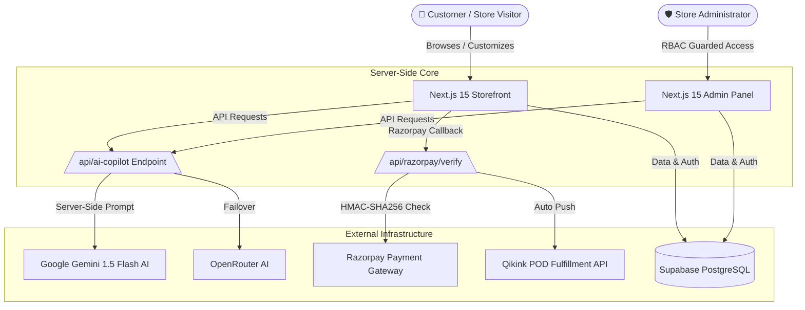

# 🎨 Alpona — Premium Print-on-Demand E-Commerce & AI Copilot Platform

> **Official Submission for Adamas University Hackathon: GameLiminals X VibeForge 1.0**  
> **Track:** AI in Finance & E-Commerce  
> **Repository:** [SohanCanSolo on GitHub](https://github.com/Sohan-DevSpace/SohanCanSolo.git)

---

## 🌟 Executive Summary

**Alpona** is a full-stack, enterprise-grade Print-on-Demand (POD) apparel e-commerce platform built with Next.js 15, Supabase, and Google Gemini AI. Designed for creative expression and modern retail, Alpona bridges the gap between custom streetwear design, instant online checkout, automated POD supply chain fulfillment, and financial AI intelligence.

It features **Alpona AI Copilot** — a unified, server-side AI suite that empowers shoppers with personalized product recommendations, protects store finances with automated fraud risk scoring, and provides admins with strategic business insights.

---

## 🚀 Key Features (A to Z Overview)

### 🤖 1. Alpona AI Copilot Suite (VibeForge AI Feature Set)
All AI features run via a single, server-side endpoint (`/api/ai-copilot`) using **Google Gemini 1.5 Flash** (with OpenRouter failover) to ensure API keys are never exposed client-side.

*   **Mode 1 — AI Shopping Assistant (Customer-Facing)**
    *   Floating chat widget in brand amber styling (`#B8763C`) present across storefront pages.
    *   Provides natural-language style advice, gift recommendations, and size tips in short, concise responses (2–3 sentences).
    *   Renders interactive, clickable product cards directly beneath chat messages.
    *   Includes session rate-limiting (max 10 queries/session) and loading skeleton states.
*   **Mode 2 — AI Smart Recommendations (Customer-Facing)**
    *   Embedded "AI Smart Pairings" on Homepage and Product Detail Pages (PDP).
    *   Ranks 4 complementary apparel items with a personalized 1-line pairing reason badge (*"Pairs well with your last order's minimalist aesthetic"*).
    *   Fast category-similarity fallback if AI services are offline.
*   **Mode 3 — AI Fraud Risk Scoring (Admin-Facing)**
    *   Advisory risk badges (`Low`, `Medium`, `High`) and scores (0–100) integrated into the Admin Orders table.
    *   Computes heuristic risk signals: order value anomalies (> ₹5,000 or >3x customer average), new account age (<3 days), rapid ordering velocity (≥3 orders in 24h), and first-time high-ticket purchases.
    *   Calls Gemini to output plain-English explanations (*"Flagged: First-time order over ₹5,000 from a new account created 2 hours ago"*).
*   **Mode 4 — AI Financial & Business Insights (Admin-Facing)**
    *   On-demand strategic intelligence card on the main Admin Dashboard.
    *   Aggregates 7–30 day revenue, order velocity, top category sales, and cancellation rates into 3–4 actionable financial bullet points.
    *   On-demand trigger button to eliminate unnecessary API cost on page loads.

---

### 🎨 2. Custom Merch Design Studio (`/create`)
*   **Real-Time Apparel Customization**: Interactive canvas editor allowing users to place custom designs on front, back, or left-pocket print positions.
*   **Print Finish Selection**: Choose between Direct-to-Film (DTF), Premium Embroidery, or Screen Printing.
*   **Dynamic Price Calculator**: Instant pricing updates based on print locations, technique, and fabric base colors.
*   **Order Generation**: Directly converts custom designs into studio order line items for production.

---

### 🛍️ 3. Storefront & Catalog Experience
*   **Dynamic Catalog & Multi-Facet Filtering**: Filter products by categories, subcategories, product types, price ranges, sizes, and colors.
*   **Rich Product Detail Pages (PDP)**: High-resolution image galleries, size guide modals, stock availability badges, and customer photo reviews.
*   **Customer Reviews & Lightbox**: Interactive review submission with rating breakdown and full-screen image lightbox modal.
*   **Cart & Wishlist**: Persistent cart and wishlist drawers with quantity updates, coupon code validation, gift wrapping options (+₹59), box packing (+₹29), and priority rush shipping (+₹100).

---

### 💳 4. Checkout, Payments & Fulfillment Engine
*   **Razorpay Integration**: Instant payment processing via UPI, NetBanking, Credit/Debit cards, and Wallets.
*   **Cryptographic Security**: HMAC-SHA256 signature verification enforced before marking any order as paid.
*   **Prepaid Incentives & COD**: Prepaid discount incentives alongside Cash on Delivery options across 19,000+ PIN codes.
*   **Automated POD Dispatch**: Direct API integration with **Qikink** to automatically push confirmed orders to print fulfillment centers.

---

### 🛡️ 5. Admin Panel & Operations (`/admin`)
*   **Role-Based Access Control (RBAC)**: Secure access restricted to authorized admin users (`role === 'admin'`).
*   **Dashboard KPIs & Live Feeds**: Real-time tracking of Today's Revenue, Active Orders, Total Customers, Avg Order Value, and gateway status checks (Supabase, Qikink, Razorpay).
*   **Order Pipeline Management**: Update order statuses through `pending` → `confirmed` → `processing` → `printed` → `packed` → `shipped` → `delivered`.
*   **CSV Data Export**: Export filtered order data to CSV for accounting and audit compliance.

---

## 🛠️ Tech Stack & Architecture

| Layer | Technology Used | Description |
| :--- | :--- | :--- |
| **Framework** | Next.js 15 (App Router) | React Server Components (RSC), Dynamic API Routes |
| **Language** | TypeScript | Strict Type Safety & Zod Schema Validation |
| **Styling** | Tailwind CSS v4 + Base UI | Matte design system with Amber (`#B8763C`) brand accents |
| **Animations** | Framer Motion & Lucide Icons | Micro-interactions, smooth drawers, & motion transitions |
| **Database & Auth** | Supabase (PostgreSQL) | Auth, RLS Policies, Database Migrations, Storage |
| **AI Engine** | Google Gemini 1.5 Flash | Multimodal AI with OpenRouter failover |
| **Payment Gateway** | Razorpay API | Secured with HMAC-SHA256 signature checking |
| **POD Logistics** | Qikink REST API | Automated print-on-demand fulfillment dispatch |
| **Image Storage** | Cloudinary | Asset migration and image CDN optimization |
| **Email Service** | Resend API | Transactional order confirmation & shipping updates |

---

## 📐 System Architecture Diagram



---

## 📁 Repository Directory Map

```
SohanCanSolo/
├── app/                        # Next.js App Router Structure
│   ├── (shop)/                 # Storefront pages (Home, Shop, PDP, Cart, Checkout)
│   ├── admin/                  # Admin Operations Panel (Dashboard, Orders, Catalog)
│   ├── api/                    # API Endpoints
│   │   ├── ai-copilot/         # Unified AI Copilot (Shopping, Recs, Fraud, Insights)
│   │   ├── razorpay/           # Payment creation & HMAC signature verification
│   │   ├── qikink/             # POD order dispatch & webhooks
│   │   └── studio/             # Custom Merch Studio order processing
│   └── globals.css             # Tailwind CSS tokens & matte design system
├── components/                 # React UI Components
│   ├── ai/                     # ShoppingCopilotWidget component
│   ├── admin/                  # FraudRiskBadge & AIInsightsCard components
│   ├── shop/                   # ProductCard, AIRecommendations, ProductDetailClient
│   ├── create/                 # DesignStudio canvas editor
│   ├── layout/                 # Navbar, Footer, AnnouncementBar
│   └── ui/                     # Base UI reusable primitives
├── lib/                        # Core Application Libraries
│   ├── ai/                     # Gemini provider, failover engine, copilot prompts
│   ├── supabase/               # Client, Server, and Admin Supabase instances
│   ├── razorpay.ts             # Razorpay API client
│   └── qikink.ts               # Qikink API client
├── docs/                       # Project Documentation & Audits
├── scripts/                    # Database seeding and Cloudinary migration scripts
├── .env.example                # Clean environment variables template
└── README.md                   # Project Documentation
```

---

## ⚡ Quickstart & Local Development Setup

### 1. Clone the Repository
```bash
git clone https://github.com/Sohan-DevSpace/SohanCanSolo.git
cd SohanCanSolo
```

### 2. Install Dependencies
```bash
npm install
```

### 3. Configure Environment Variables
Copy the template `.env.example` to `.env.local` and populate your API credentials:
```bash
cp .env.example .env.local
```

Example required variables in `.env.local`:
```env
NEXT_PUBLIC_APP_URL=http://localhost:3000

# Supabase
NEXT_PUBLIC_SUPABASE_URL=https://your-supabase-project.supabase.co
NEXT_PUBLIC_SUPABASE_ANON_KEY=your-supabase-anon-key
SUPABASE_SERVICE_ROLE_KEY=your-supabase-service-role-key

# Razorpay
NEXT_PUBLIC_RAZORPAY_KEY_ID=rzp_test_your_key_id
RAZORPAY_KEY_SECRET=your_razorpay_key_secret

# AI Engine
GEMINI_API_KEY=your_gemini_api_key

# Qikink & Cloudinary
QIKINK_CLIENT_ID=your_qikink_client_id
QIKINK_CLIENT_SECRET=your_qikink_client_secret
CLOUDINARY_API_KEY=your_cloudinary_api_key
CLOUDINARY_API_SECRET=your_cloudinary_api_secret
```

### 4. Run the Development Server
```bash
npm run dev
```
Open [http://localhost:3000](http://localhost:3000) in your browser.

---

## 🔒 Security & Guardrails Summary

1.  **Strict Server-Side AI Execution**: Gemini API keys are consumed exclusively in server-side API routes (`/api/ai-copilot`). No AI credentials are exposed to the client bundle.
2.  **Payment Signature Verification**: All Razorpay payment confirmations are cryptographically validated using HMAC-SHA256 (`RAZORPAY_KEY_SECRET`) before orders are marked `paid`.
3.  **Admin Auth Gating**: Admin endpoints and AI Modes 3 & 4 require authentication and verify admin role permissions (`role === 'admin'`) via Supabase RLS and server middleware.
4.  **Graceful AI Failover**: Every AI invocation is wrapped in try/catch blocks with deterministic fallbacks to ensure the application never crashes if an external API times out.
5.  **Output Sanitization**: AI text responses are sanitized and rendered as plain text strings to prevent cross-site scripting (XSS).

---

## 🤝 Hackathon Submission Credits

*   **Hackathon**: Adamas University — GameLiminals X VibeForge 1.0
*   **Track**: AI in Finance & E-Commerce
*   **Project**: Alpona — Premium Print-on-Demand E-Commerce & AI Platform
*   **Developed by**: Team SohanCanSolo

---
*Built with passion for GameLiminals X VibeForge 1.0*