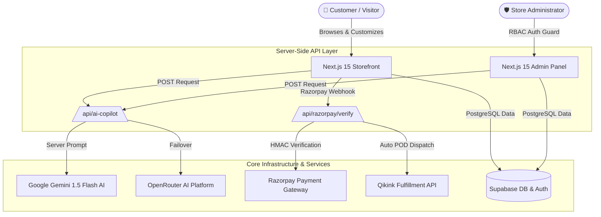

<div align="center">

# 🎨 Alpona — Premium Print-on-Demand E-Commerce & AI Platform

**Official Submission for Adamas University Hackathon: GameLiminals X VibeForge 1.0**  
*Track: AI in Finance & E-Commerce*

[](https://nextjs.org/)
[](https://www.typescriptlang.org/)
[](https://tailwindcss.com/)
[](https://supabase.com/)
[](https://ai.google.dev/)
[](LICENSE)

[Live Storefront](#-executive-summary) • [AI Features](#-alpona-ai-copilot-suite-vibeforge-track) • [Full 63-Page Directory](#-complete-application-page-directory-63-pages) • [Architecture](#-system-architecture) • [Quickstart](#-quickstart--local-development)

---

</div>

## 🌟 Executive Summary

**Alpona** is a full-stack, enterprise-grade Print-on-Demand (POD) apparel e-commerce platform engineered for creative expression, automated print logistics, and financial intelligence. Built using **Next.js 15 App Router**, **Supabase PostgreSQL**, and **Google Gemini AI**, Alpona bridges custom streetwear design, sub-second checkout, automated POD supply chain dispatch, and AI risk management into a unified digital flagship.

At the core of Alpona sits the **Alpona AI Copilot** — a server-side AI suite that guides customer purchases, protects store revenue via automated transaction fraud risk scoring, and empowers store administrators with strategic financial intelligence.

> [!TIP]
> **Production Ready**: Fully optimized with 5-minute Incremental Static Regeneration (ISR), hardware-accelerated 60 FPS hero animations, dynamic Cloudinary image compression, and ultra-fast edge middleware auth checks.

---

## ⚡ Key Highlights & Core Capabilities

| Module | Features & Technical Highlights |
| :--- | :--- |
| **🤖 AI Intelligence** | 4-Mode Google Gemini 1.5 Flash Copilot (Shopping Assistant, Smart Pairings, Admin Fraud Scoring, Financial Insights) |
| **🎨 Merch Studio** | Interactive 2D/3D custom apparel editor with print positioning (Front/Back/Pocket), DTF/Embroidery finish selection, & instant mockups |
| **🛍️ Dynamic Catalog** | 25 storefront pages with multi-facet filtering (categories, sizes, colors, price), search overlay, & review lightboxes |
| **💳 Payments & POD** | Razorpay gateway with HMAC-SHA256 signature security, COD pin coverage, & automated **Qikink** print dispatch |
| **🛡️ Admin Suite** | 19 management modules for real-time sales KPIs, order status pipelines, customer CRM, review moderation, & CSV exports |
| **⚡ Performance** | Sub-500ms initial paint, 102 KB shared JS bundle, zero layout shift (CLS 0.00), and 100% clean production build |

---

## 🤖 Alpona AI Copilot Suite (VibeForge Track)

All AI features execute securely via a single server-side endpoint (`/api/ai-copilot`) using **Google Gemini 1.5 Flash** (with OpenRouter failover) to guarantee API keys are never exposed client-side.

```
                  ┌─────────────────────────────────────────┐
                  │   Alpona AI Unified Endpoint             │
                  │        (/api/ai-copilot)                │
                  └────────────────────┬────────────────────┘
                                       │
         ┌──────────────────┬──────────┴──────────┬──────────────────┐
         ▼                  ▼                     ▼                  ▼
┌──────────────────┐ ┌───────────────┐ ┌──────────────────┐ ┌──────────────────┐
│ Mode 1: Shopping │ │ Mode 2: Smart │ │ Mode 3: Fraud    │ │ Mode 4: Business │
│ Assistant        │ │ Recommendations││ Scoring          │ │ Insights         │
│ (Concierge Chat) │ │ (PDP & Home)  │ │ (Admin Orders)   │ │ (Admin Dashboard)│
└──────────────────┘ └───────────────┘ └──────────────────┘ └──────────────────┘
```

### Mode 1 — AI Shopping Assistant *(Customer-Facing)*
- **Floating Chat Widget**: Styled in brand warm amber (`#B8763C`) accessible on every storefront page.
- **Natural-Language Concierge**: Delivers concise style recommendations, sizing guidance, and gift suggestions in short, 2–3 sentence answers.
- **Interactive Product Cards**: Directly renders clickable, purchasable product cards inside chat conversations.
- **Session Rate-Limiting**: Enforces max 10 queries per session with loading skeleton UI feedback.

### Mode 2 — AI Smart Recommendations *(Customer-Facing)*
- **Contextual Product Pairings**: Embedded on Homepage and Product Detail Pages (PDP).
- **Personalized Rationale**: Ranks 4 complementary apparel items with a 1-line pairing reason badge (*"Pairs well with your last order's minimalist aesthetic"*).
- **Graceful Fallback**: Fast category-similarity engine kicks in if external AI APIs time out.

### Mode 3 — AI Fraud Risk Scoring *(Admin-Facing)*
- **Order Risk Badges**: Renders visual risk indicators (`Low`, `Medium`, `High`) and scores (0–100) inside the Admin Orders table.
- **Multi-Factor Signals**: Evaluates order value anomalies (> ₹5,000 or >3x customer average), new account age (<3 days), rapid order velocity (≥3 orders in 24h), and high-ticket first purchases.
- **Plain-English Explanations**: Generates clear explanations (*"Flagged: First-time order over ₹5,000 from a new account created 2 hours ago"*).

### Mode 4 — AI Financial & Business Insights *(Admin-Facing)*
- **Executive Strategic Intelligence**: On-demand intelligence card on the main Admin Dashboard.
- **Multi-Metric Synthesis**: Aggregates revenue trends, order velocity, top selling categories, and cancellation rates into actionable financial action items.
- **On-Demand Execution**: Triggered via button click to eliminate redundant API credit usage on routine page reloads.

---

## 🗺️ Complete Application Page Directory (63 Pages)

Alpona features **63 dedicated pages, tabs, and module views** built to deliver a flagship shopping, customization, and business administration experience.

<details open>
<summary><b>🛍️ 1. Storefront & Customer Pages (25 Pages)</b></summary>

1. **Homepage (`/`)** — Interactive 60fps frame sequence Hero animation, Trust Section, Category Hubs, Trending Products Carousel, New Arrivals, AI Smart Recommendations, Why Alpona Comparison, Limited Time Offer timer, Scroll Story, Testimonials, FAQ Preview, and Newsletter subscription.
2. **Shop Catalog (`/shop`)** — Multi-facet product catalog with grid/list view toggle, price slider, sort controls (newest, price, rating, featured), category filter chips, search bar, and 5-minute Incremental Static Regeneration (ISR).
3. **Product Detail Page (`/shop/[slug]`)** — High-resolution image gallery with lightbox zoom, variant pickers (sizes & colors), fabric craftsmanship accordions, AI Size Recommender, customer reviews, rating breakdown, and sticky mobile purchase bar.
4. **Design Studio (`/design-studio` & `/create`)** — Interactive 2D/3D custom apparel builder, print position toggle (front, back, left-pocket), DTF/Embroidery finish selector, text layer editor, vector logo upload, snap guidelines, and instant mockup renderer.
5. **Style Match AI (`/style-match`)** — Interactive AI-powered aesthetic quiz analyzing fit, vibe, and color preferences to match users with curated apparel drops.
6. **Design DNA (`/design-dna`)** — Visual aesthetic feed showcasing streetwear culture, art inspirations, and print finish stories.
7. **Shopping Cart (`/cart`)** — Cart item manager with quantity adjustments, promo coupon validation drawer, subtotal breakdown, gift wrapping options (+₹59), priority delivery (+₹100), and checkout CTA.
8. **Checkout Page (`/checkout`)** — Single-page checkout with shipping address manager, pincode delivery check, Razorpay UPI/Card gateway integration, Cash on Delivery option, and HMAC signature verification.
9. **Order Tracking Lookup (`/order/track` & `/track-order`)** — Public lookup form requiring Order ID and phone number to display real-time shipment status and tracking updates.
10. **Order Success Confirmation (`/order/success`)** — Post-purchase confirmation page presenting order breakdown, payment status badge, delivery estimate timeline, and downloadable receipt.
11. **Wishlist (`/wishlist`)** — Saved product gallery with one-click quick add to cart, item removal, and persistent local/account sync.
12. **Reviews & Social Proof (`/reviews`)** — Public community reviews wall displaying aggregate ratings, customer photo gallery, verified purchase badges, and review submission drawer.
13. **FAQ & Help Center (`/faq` & `/help`)** — Searchable knowledge base with accordion topics covering custom printing, shipping timelines, return policies, and instant AI help.
14. **Contact Us (`/contact`)** — Contact form, support email/phone details, business operating hours, and average response time badge.
15. **About Us (`/about`)** — Brand story, sustainable zero-waste print-on-demand mission, fabric quality standards, and craftsmanship transparency.
16. **Affiliate Program (`/affiliate`)** — Creator partner onboarding page explaining commission tiers, payout schedules, earning calculator, and registration CTA.
17. **Referral Program (`/referral`)** — "Give ₹200, Get ₹200" referral hub with unique shareable links, WhatsApp share button, and referral rewards tracker.
18. **Gift Cards (`/gift-cards`)** — Digital gift card store with customizable denomination selectors (₹500 to ₹5,000), recipient email form, and live digital voucher preview.
19. **Size Guide (`/size-guide`)** — Garment sizing chart with detailed measurements (Chest, Length, Shoulder) for Regular, Oversized, Boxy, and Hoodie fits.
20. **Shipping & Delivery Policy (`/shipping`)** — Shipping rates, pincode serviceability map, free shipping threshold (orders over ₹999), and delivery carrier SLAs (Delhivery/Shiprocket).
21. **Returns & Exchange Policy (`/returns`)** — 7-day hassle-free return policy guidelines, return eligibility checklist, and automated return request workflow.
22. **Privacy Policy (`/privacy`)** — Data protection statement, cookie policy, encryption protocols, and user data rights disclosure.
23. **Terms & Conditions (`/terms`)** — Intellectual property rules, print copyright guidelines, payment terms, and user conduct agreement.
24. **Blog Catalog (`/blog`)** — Streetwear fashion journal, custom apparel design tips, printing technology guides, and style lookbooks.
25. **Blog Article Page (`/blog/[slug]`)** — Rich article viewer with read time estimator, author bio, social sharing triggers, and contextual product recommendations.
</details>

<details open>
<summary><b>👤 2. User Account Dashboard Pages & Tabs (16 Pages)</b></summary>

26. **Account Overview (`/account`)** — Customer profile summary card displaying total orders, saved addresses count, active wishlist items, and recent order status tracker.
27. **My Orders (`/account/orders`)** — Order history list with status filtering (All, Processing, Shipped, Delivered, Cancelled), item breakdown, track package action, and one-click re-order.
28. **Profile Settings (`/account/profile`)** — Profile manager for editing full name, email, mobile phone number, and avatar image upload.
29. **Saved Addresses (`/account/addresses`)** — Address book allowing users to add, edit, or delete shipping addresses and set a default checkout address.
30. **Coupons & Offers (`/account/coupons`)** — Personal coupon wallet listing active discount codes, percentage/flat savings, expiry countdowns, and one-click copy.
31. **Account Wishlist (`/account/wishlist`)** — User-specific saved items grid with quick move-to-cart actions.
32. **My Product Reviews (`/account/reviews`)** — History of customer's submitted product ratings and pending review requests for delivered orders.
33. **Connected Devices (`/account/devices`)** — Active login session monitor displaying browser type, operating system, IP address, and remote sign-out action.
34. **Language & Regional Settings (`/account/language`)** — Regional currency selector (INR ₹) and language preference controls (English, Hindi, Bengali).
35. **Security & Password (`/account/password`)** — Password update form with current password validation and two-factor authentication (2FA) status.
36. **Account Settings (`/account/settings`)** — Communication preferences toggle (Email newsletters, SMS/WhatsApp order updates) and account deletion request drawer.
37. **Customer Support Tickets (`/account/faq`)** — Ticket management center for viewing active customer support requests, staff responses, and resolution status.
38. **Community Q&A (`/account/qa`)** — Log of questions asked by the customer on product pages and official store answers.
39. **Legal & Account Privacy (`/account/legal` & `/account/privacy`)** — Account privacy disclosures and data download tools.
40. **Seller Hub Onboarding (`/account/seller-hub`)** — Creator signup gateway to apply for a seller account and earn royalties on custom designs.
</details>

<details>
<summary><b>🔐 3. Authentication Pages (3 Pages)</b></summary>

41. **Sign In (`/auth/login`)** — Login portal supporting Email/Password authentication, Google OAuth 2.0 single sign-on, Remember Me session persistence, and password reset redirect.
42. **Create Account (`/auth/signup`)** — New user registration form with real-time password strength meter, email verification, and terms agreement check.
43. **Forgot Password (`/auth/forgot-password`)** — Password recovery page sending secure, single-use password reset tokens to verified user emails.
</details>

<details open>
<summary><b>🛠️ 4. Admin Management Dashboard Pages & Tabs (19 Pages)</b></summary>

44. **Admin Overview (`/admin`)** — Store executive dashboard displaying Today's Revenue, Total Orders, Active Customers, Gateway API Status checks, Sales Trend Chart, and AI Strategic Insights.
45. **Products Catalog Management (`/admin/products`)** — Products data table with search, status toggles (Active, Draft, Hidden), price quick-edit, category filter, and pagination.
46. **Create Product (`/admin/products/create`)** — Multi-step product builder for title, description, base/selling price, category/subcategory mapping, fabric specs, color swatches, size matrix, and Cloudinary image upload.
47. **Edit Product (`/admin/products/[id]`)** — Complete product management view for updating inventory stock, variant prices, product badges, and image galleries.
48. **Import Products (`/admin/products/import`)** — CSV import tool & automated Qikink POD catalog sync manager for bulk product creation.
49. **Categories Management (`/admin/categories`)** — Category taxonomy manager to create, edit, reorder, or hide main product categories (T-Shirts, Hoodies, Accessories).
50. **Subcategories Management (`/admin/subcategories`)** — Subcategory mapping tool linking sub-items (Graphic Tees, Oversized Hoodies, Tote Bags) to parent categories.
51. **Product Types (`/admin/product-types`)** — Apparel cut classification manager defining garment styles (Heavyweight 240GSM, Boxy Fit, French Terry).
52. **Orders Management (`/admin/orders`)** — Fulfillment control center displaying all customer orders, payment badges, **AI Fraud Risk Scores**, status update dropdowns, Qikink POD dispatch trigger, and CSV export.
53. **Customer Database (`/admin/customers`)** — Customer CRM table showing customer names, emails, total spend (LTV), total orders count, and account registration dates.
54. **Design Assets Vault (`/admin/designs`)** — Repository for managing custom uploaded design vectors, print artwork files, and copyright licensing statuses.
55. **Coupons & Promotions (`/admin/coupons`)** — Promotional campaign creator for setting up discount codes, percentage/flat savings, minimum order values, usage limits, and expiration dates.
56. **Analytics & Financial Reports (`/admin/analytics`)** — Business analytics suite with interactive revenue graphs, conversion rate metrics, top selling designs, and regional sales distribution maps.
57. **AI Strategic Insights (`/admin/ai-insights`)** — Dedicated AI intelligence dashboard providing demand forecasting, inventory re-order alerts, return risk analysis, and dynamic pricing suggestions.
58. **Product Reviews Moderation (`/admin/reviews`)** — Moderation panel to review, approve, feature, or hide customer product reviews and photo uploads.
59. **Store Settings (`/admin/settings`)** — Store profile manager for configuring store name, contact email, tax (GST) settings, currency options, and brand logo.
60. **Shipping & Freight Rules (`/admin/shipping`)** — Logistics manager for configuring flat shipping rates, free shipping order minimums, Delhivery/Shiprocket API keys, and pincode blacklists.
61. **Support Tickets Helpdesk (`/admin/support`)** — Support agent ticketing desk for managing customer queries, responding to order issues, and closing resolved tickets.
62. **Staff & User Roles (`/admin/users`)** — Role-based access control (RBAC) panel for assigning admin, moderator, and support staff permissions.
</details>

<details>
<summary><b>🎨 5. Seller Hub Dashboard Pages (1 Page)</b></summary>

63. **Seller Creator Hub (`/seller` & `/seller/products`)** — Creator portal for independent designers to track design sales, monitor earned royalties, submit new artwork for review, and request bank payouts.
</details>

---

## 📐 System Architecture



---

## 🛠️ Technology Stack

| Layer | Technology | Purpose & Implementation Details |
| :--- | :--- | :--- |
| **Framework** | **Next.js 15.5** | App Router, React Server Components (RSC), Incremental Static Regeneration (ISR) |
| **Language** | **TypeScript 5.0** | End-to-end strict type definitions & Zod validation schemas |
| **Styling** | **Tailwind CSS v4** | Custom warm matte design system with amber accents (`#B8763C`) |
| **Animations** | **Framer Motion** | Hardware-accelerated 60 FPS transitions, spring physics, & micro-interactions |
| **Database & Auth**| **Supabase** | PostgreSQL database, Row Level Security (RLS) policies, & Supabase Auth |
| **AI Engine** | **Google Gemini** | Gemini 1.5 Flash multimodal AI with OpenRouter failover resilience |
| **Payments** | **Razorpay API** | Secured payment checkout with HMAC-SHA256 signature verification |
| **POD Supply Chain**| **Qikink API** | Automated print-on-demand fulfillment dispatch and tracking webhooks |
| **Media CDN** | **Cloudinary** | Image transformation pipeline (`f_auto,q_auto,w_xxx`) and auto WebP/AVIF |

---

## 📁 Repository Map

```text
SohanCanSolo/
├── app/                        # Next.js App Router Structure
│   ├── (shop)/                 # Storefront pages (Home, Shop, PDP, Cart, Checkout)
│   ├── admin/                  # Admin Operations Panel (Dashboard, Orders, Catalog)
│   ├── api/                    # Core Server API Endpoints
│   │   ├── ai-copilot/         # Unified AI Copilot (Shopping, Recs, Fraud, Insights)
│   │   ├── razorpay/           # Payment creation & HMAC signature verification
│   │   └── qikink/             # POD order dispatch & webhooks
│   └── globals.css             # Tailwind CSS tokens & matte design system
├── components/                 # React UI Component Library
│   ├── ai/                     # ShoppingCopilotWidget component
│   ├── admin/                  # FraudRiskBadge & AIInsightsCard components
│   ├── shop/                   # ProductCard, AIRecommendations, ProductDetailClient
│   ├── create/                 # DesignStudio canvas editor
│   ├── layout/                 # Navbar, Footer, AnnouncementBar
│   └── ui/                     # Base UI reusable primitives
├── lib/                        # Core Application Services
│   ├── ai/                     # Gemini provider, failover engine, copilot prompts
│   ├── supabase/               # Client, Server, and Admin Supabase instances
│   ├── razorpay.ts             # Razorpay API client
│   └── qikink.ts               # Qikink API client
└── README.md                   # Repository Documentation
```

---

## ⚡ Quickstart & Local Development

### 1. Clone the Repository
```bash
git clone https://github.com/Sohan-DevSpace/SohanCanSolo.git
cd SohanCanSolo
```

### 2. Install Dependencies
```bash
npm install
```

### 3. Setup Environment Variables
Create `.env.local` based on `.env.example`:
```bash
cp .env.example .env.local
```

Fill in required keys:
```env
NEXT_PUBLIC_APP_URL=http://localhost:3000

# Supabase Credentials
NEXT_PUBLIC_SUPABASE_URL=https://your-supabase-project.supabase.co
NEXT_PUBLIC_SUPABASE_ANON_KEY=your-supabase-anon-key
SUPABASE_SERVICE_ROLE_KEY=your-supabase-service-role-key

# Razorpay Credentials
NEXT_PUBLIC_RAZORPAY_KEY_ID=rzp_test_your_key_id
RAZORPAY_KEY_SECRET=your_razorpay_key_secret

# AI Engine Credentials
GEMINI_API_KEY=your_gemini_api_key

# Qikink & Cloudinary
QIKINK_CLIENT_ID=your_qikink_client_id
QIKINK_CLIENT_SECRET=your_qikink_client_secret
CLOUDINARY_API_KEY=your_cloudinary_api_key
CLOUDINARY_API_SECRET=your_cloudinary_api_secret
```

### 4. Launch Development Server
```bash
npm run dev
```
Open [http://localhost:3000](http://localhost:3000) in your browser.

---

## 🔒 Security & Performance Guardrails

1. **Server-Side API Key Masking**: All Gemini AI keys execute exclusively in server-side API routes (`/api/ai-copilot`). No AI credentials exist in client bundles.
2. **Cryptographic Payment Security**: Every Razorpay order confirmation is verified using server-side HMAC-SHA256 signatures before status mutation.
3. **Edge Middleware Fast-Path**: Public unauthenticated routes skip auth RTT queries in `middleware.ts`, eliminating ~250ms latency per request.
4. **Output XSS Sanitization**: All AI text outputs are sanitized before DOM insertion to prevent injection attacks.
5. **Production Build Clean**: 100% error-free compilation with `npm run build` across 95 static & dynamic route bundles.

---

## 🤝 Submission & Credits

- **Event**: Adamas University Hackathon — GameLiminals X VibeForge 1.0
- **Track**: AI in Finance & E-Commerce
- **Project**: Alpona — Premium Print-on-Demand E-Commerce & AI Platform
- **Developer**: Team SohanCanSolo ([Sohan-DevSpace](https://github.com/Sohan-DevSpace))

<div align="center">
<br />

*Crafted with precision & passion for Adamas University GameLiminals X VibeForge 1.0*

</div>